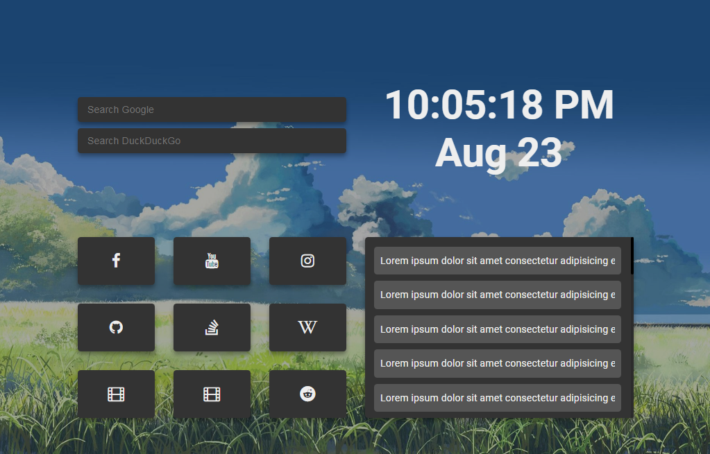

# StartPage

</img>

A Browser StartPage with links to top visited websites, your local time, search bars for Google and DuckDuckGo and a newsfeed scraped from Reddit r/worldnews.

Live Demo: https://zainsci.github.io/startpage/

## Usage

```
$ git clone https://github.com/zainsci/startpage.git

$ cd startpage

$ mkdir Images

$ python scrape_wallpapers.py

```

## Files

1. scrape_wallpapers.py will scrape wallpapers from /r/Animewallpapers subreddit and saves them in the Images Folder that we cerated earlier.
2. /js/time.js updates time on the page.
3. /js/news.js scrapes top news from /r/worldnews subreddit and displays it in the news section.

---

Any tips on how it can be better or suggestions are appreciated.
